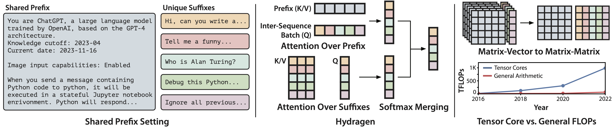

# Hydragen

This repo provides the accompanying code for [Hydragen: High-Throughput LLM Inference with Shared Prefixes](https://arxiv.org/abs/2402.05099). Our goal is to provide a simple and efficient implementation of the shared-prefix optimizations described in the paper, in the style of [gpt-fast](https://github.com/pytorch-labs/gpt-fast).

Hydragen is an efficient, exact implementation of scaled-dot-product attention for batches of sequences that share common prefixes. Using a shared prefix is a common setting for LLM inference: few-shot examples can be reused across multiple problems, many candidate solutions can be sampled from a single prompt (e.g. AlphaCode, self-consistency), and chatbots may serve multiple users with the same system instructions. 

With large batch sizes or long shared prefixes, Hydragen can significantly improve end-to-end generation throughput. This repo implements the Hydragen attention operation and integrates it into the Llama family of models.




Quick Links:
- [Installation](#installation)
- [Quickstart Script](#quickstart-script)
- [Using Hydragen Models in Code](#using-hydragen-models-in-code)
- [Using the Hydragen Attention Operation](#using-the-hydragen-attention-operation)
- [How Hydragen Works](#how-hydragen-works)
- [Benchmarking Scripts](#benchmarking-scripts)
- [Limitations](#limitations)


# Installation
First get set up with an environment containing PyTorch with CUDA support. We use a conda environment with Python 3.11.5, PyTorch 2.1.2, and CUDA 12.1, which can be installed using:

```bash
conda create -n hydragen python=3.11.5
conda activate hydragen
conda install pytorch==2.1.2 torchvision==0.16.2 torchaudio==2.1.2 pytorch-cuda=12.1 -c pytorch -c nvidia
conda install nvidia/label/cuda-12.1.0::cuda
```

The rest of the project's dependencies can be installed by cloning this repository and running:

```bash
pip install packaging==24.0 ninja==1.11.1.1 && pip install -e .
```

To install packages needed for benchmarking vLLM baselines and testing, additionally install

```bash
pip install -r requirements-dev.txt
```

# Quickstart Script

The fastest way to start generating text with Hydragen is using `scripts/run.py`. The script supports generating completions from a single prompt, as well as more complicated hierarchical sharing patterns.

```bash

# Generate many completions from a single prompt
python scripts/run.py --pretrained-name princeton-nlp/Sheared-LLaMA-1.3B --dtype float16 --prompts "Attention is" --num-return-sequences 4 --max-new-tokens 8

# Complete the prompts "Attention is all you need" and "Attention is not all you need", sharing the portion "Attention is".
python scripts/run.py --pretrained-name princeton-nlp/Sheared-LLaMA-1.3B --dtype float16 --prompts "Attention is" --prompts "all you need|not all you need" --num-return-sequences 1 --max-new-tokens 8
```

# Using Hydragen Models in Code

This codebase supports models in the Llama family, i.e. anything that uses the `LlamaForCausalLM` class on Huggingface (for example, Llama v2 and v3, CodeLlama, and Yi models). We've generally followed the Huggingface interface for instantiating models and generating text from them, except that you (a) must allocate KV caches before generation and (b) can now specify shared portions of the input ids.

## A Simple Example

To start, let's generate multiple completions from a single prompt, while efficiently sharing the prompt ids across all completions:

```python
from hydragen.llama import HydragenLlamaForCausalLM
from transformers import AutoTokenizer
import torch

dtype = "auto"
device = "cuda"
pretrained_name = "meta-llama/Llama-2-7b-hf"

model = HydragenLlamaForCausalLM.from_pretrained(
    pretrained_name, torch_dtype=dtype, device_map=device
)

tokenizer = AutoTokenizer.from_pretrained(pretrained_name)
tokenizer.padding_side = "right"
tokenizer.pad_token_id = tokenizer.eos_token_id

base_prompt = "Harry Potter is"

base_prompt_inputs = tokenizer(base_prompt, return_tensors="pt")
base_ids = base_prompt_inputs.input_ids.to(device)

torch.manual_seed(0)

model.setup_caches(
    max_unique_batch_size=8, 
    max_unique_seq_length=16,
    max_shared_batch_sizes=[base_ids.shape[0]],
    max_shared_seq_lengths=[base_ids.shape[1]]
)

new_ids = model.generate(
    input_ids=base_ids,
    num_return_sequences=8,
    max_new_tokens=16,
    temperature=0.6,
)

print("\n\n\n".join(tokenizer.batch_decode(new_ids)))
```

You should see an output like:

```
a series of seven fantasy novels written by British author J.K.


a series that needs no introduction.
The books have sold over 45


a series of seven fantasy novels written by British author J.K.


one of the most successful book series of all time. The books have sold over


one of the most popular and successful book series of all time. Harry Potter


the best-selling book series ever in history. So it’s not


a series of fantasy novels written by J. K. Rowling.


an absolute classic in the world of literature and film. However, for kids
```

## Hierarchies and More Complicated Sharing Patterns

To support multiple levels of sharing, we can supply a list of tensors to the `input_ids` argument. The example below generates two completions for each of the prompts `["The best starter Pokemon is Piplup because", "The best starter Pokemon is Chimchar because", "The best starter Pokemon is Turtwig because"]`, totalling six generated sequences. We have two levels of sharing in this example: the initial prompt `"The best starter Pokemon is"` is shared across all six sequences in the batch, while each second-level prompt `"{pokemon_name} because"` is shared across the second-level prompt's two completions.

```python
prompt_list = [
    ["The best starter Pokemon is"],
    ["Piplup because", "Chimchar because", "Turtwig because"],
]

input_ids = []
seq_lens = []

for i, prompts in enumerate(prompt_list):
    prompt_inputs = tokenizer(prompts, return_tensors="pt", padding=True, add_special_tokens=(i==0)).to(device)
    input_ids.append(prompt_inputs.input_ids)
    seq_lens.append(prompt_inputs.attention_mask.sum(dim=1))

model.setup_caches(
    max_unique_batch_size=6, 
    max_unique_seq_length=128,
    max_shared_batch_sizes=[ids.shape[0] for ids in input_ids],
    max_shared_seq_lengths=[ids.shape[1] for ids in input_ids],
)

# enables CUDA graphs during decoding, which can make things much faster
model.graph()

# generate two completions per sequence
new_ids = model.generate(
    input_ids=input_ids,
    seq_lens=seq_lens,
    num_return_sequences=2,
    max_new_tokens=128,
    temperature=0.6,
)

print("\n\n\n".join(tokenizer.batch_decode(new_ids)))
```

## KV Cache Internals

To store the attention keys and values of previous tokens, our code maintains two types of KV caches: 

- A "unique" cache that stores the KVs for tokens that are unique to each sequence in the batch (e.g. sequence suffixes and generated completions).
- Zero or more "shared" caches that store the KVs of prefix tokens that are common to multiple sequences in the batch.

There is always exactly one unique cache, while the number of shared caches depends on the number of hierarchical sharing levels (in the Pokemon example above, there are two shared caches). The maximum sizes (both in terms of batch size and sequence length) of all caches must be specified ahead of time (in `setup_caches`).

## Finer-Grained Control

Sometimes it can be helpful to control the KV caches more directly. For example, you may want to generate a very large number of completions from a single prompt (i.e. more completions than can fit in a single batch) without re-processing the shared prompt or re-capturing the CUDA graph.

There are two main ways to do this: using the `shared_cache_op` argument to `generate` or by making manual calls to add/remove shared caches.

### Using `shared_cache_op`

The `shared_cache_op` argument to `generate` controls how the KV cache is modified during and after generation. By default, the arg is set to `"preserve"`, which will keep any pre-existing cache levels, add any new ones passed in by the user (through `input_ids`), and then remove the new cache levels after generation. 

Alternatively, setting the op to `"wipe"` will clear the shared cache before generation (and not remove any newly added cache levels), while an op of `"extend"` will keep both any pre-existing cache levels and newly added ones, not removing anything.

To generate a large number of completions from a single prompt, use `"extend"` in the first `generate` call in order to add the new shared cache levels, and use `"preserve"` in subsequent calls to `generate`. Note that you need to store the logits from the initial `generate` call to sample initial completion tokens in future calls.

```python
total_num_completions = 64
batch_size = 8

prompt_ids = tokenizer("Once upon a time,", return_tensors="pt").input_ids.to(device)

model.setup_caches(
    max_unique_batch_size=total_num_completions, 
    max_unique_seq_length=128,
    max_shared_batch_sizes=[prompt_ids.shape[0]],
    max_shared_seq_lengths=[prompt_ids.shape[1]],
)

model.graph()

# this initial call will process the prompt
# and keep it around in a shared cache for later
# calls. we also return the logits (with return_logits=True)
# so we use them to sample first tokens in later calls.
first_new_ids, logits = model.generate(
    input_ids=prompt_ids,
    num_return_sequences=batch_size,
    max_new_tokens=128,
    temperature=1,
    return_logits=True,
    shared_cache_op="extend"
)

starting_logits = logits[0][0:1]

all_new_ids = [first_new_ids]

for i in range(total_num_completions // batch_size - 1):
    new_ids = model.generate(
        starting_logits=starting_logits,
        num_return_sequences=batch_size,
        max_new_tokens=128,
        temperature=1,
    )
    all_new_ids.append(new_ids)

# clear the cache when we're done
model.empty_shared_cache()

cat_new_ids = torch.cat(all_new_ids, dim=0)

print("\n\n\n".join(tokenizer.batch_decode(cat_new_ids)))
```


### Manual Cache Operations

Alternatively, you can make explicit calls to `append_shared` to manage the shared caches:

```python
total_num_completions = 64
batch_size = 8

prompt_ids = tokenizer("Once upon a time,", return_tensors="pt").input_ids.to(device)

model.setup_caches(
    max_unique_batch_size=batch_size, 
    max_unique_seq_length=128,
    max_shared_batch_sizes=[prompt_ids.shape[0]],
    max_shared_seq_lengths=[prompt_ids.shape[1]],
)

model.graph()

prefill_logits = model.append_shared(
    input_ids=prompt_ids
)

starting_logits = prefill_logits[:, -1]

all_new_ids = []

for i in range(total_num_completions // batch_size):
    new_ids = model.generate(
        starting_logits=starting_logits,
        num_return_sequences=batch_size,
        max_new_tokens=128,
        temperature=1,
    )
    all_new_ids.append(new_ids)

# clear the cache when we're done
model.empty_shared_cache()

cat_new_ids = torch.cat(all_new_ids, dim=0)

print("\n\n\n".join(tokenizer.batch_decode(cat_new_ids)))
```

## Using Multiple GPUs with Tensor Parallelism

To distribute a model across multiple GPUs, first split the model checkpoint with `make_tp_files.py`. For example, if you want to shard Llama-2-7b across four GPUs, use:

```bash
python hydragen/make_tp_files.py meta-llama/Llama-2-7b-hf llama2_7b_split4 --num-splits 4
```

The model can then be loaded with:

```python

from hydragen.utils import maybe_init_dist
from hydragen.tp import from_pretrained_tp

model_name = "meta-llama/Llama-2-7b-hf"
tp_path = "llama2_7b_split4"

rank = maybe_init_dist()
model = from_pretrained_tp(pretrained_name, tp_path, dtype="auto")
```

You can then call `setup_caches` and `generate` normally. Be sure to use `torchrun` to launch your script. For example, to use our provided runner script, use:

```bash
torchrun --nproc_per_node 4 scripts/run.py --pretrained-name meta-llama/Llama-2-7b-hf --tp-path llama2_7b_split4 --dtype auto
```

# Using the Hydragen Attention Operation

You can also use our implementation of Hydragen attention outside of our model code:

```python
import torch
from hydragen.attention import hydragen_attention_nopad

device = "cuda:0"
dtype = torch.float16


bs = 8
qheads = 32
kvheads = 8
head_dim = 128

unique_len = 128
unique_size = 256
shared_lens = [64, 8, 200]
shared_bs = [1, 2, 8]

# this example shows the decoding case (num queries per sequence = 1), 
# but the same code works for more queries as well.
q = torch.randn(bs, 1, qheads, head_dim, device=device, dtype=dtype)

# this is the unique-per-completion kv cache, which may have extra padding for
# each sequence which isn't currently used.
# the seq_lens controls how much of the unique kv cache is used, can be None
# if the whole cache is used.
k = torch.randn(bs, unique_size, kvheads, head_dim, device=device, dtype=dtype)
v = torch.randn_like(k)
seq_len = torch.tensor([unique_len] * bs, device=device)

# the shared caches cannot be padded
shared_ks = [
    torch.randn(sb, sl, kvheads, head_dim, device=device, dtype=dtype)
    for sb, sl in zip(shared_bs, shared_lens)
]
shared_vs = [torch.randn_like(sk) for sk in shared_ks]

attention_out = hydragen_attention_nopad(q, k, v, shared_ks, shared_vs, seq_len)
```

If you need to use shared caches containing sequences that differ in length within the same cache level, use the more fully-featured `hydragen.attention.hydragen_attention` function.


# How Hydragen Works

Normally, attention is computed independently for every sequence in the batch. During the decoding loop of text generation, where there is only a single query per sequence, this attention implementation is memory bound and uses matrix-vector products, leading to poor hardware utilization. When sequences in the batch share prefixes, their KV caches overlap at positions corresponding to the prefix. Hydragen exploits this KV overlap to compute attention much more efficiently.

Hydragen is a combination of two techinques:
1. Attention Decomposition: We compute attention over each full sequence by first computing attention separately over the shared prefix and the unique suffix and then combining these results. In order to do this combination, we need to store the log-sum-exp (LSE), i.e. the log of the softmax denominator, from each sub-computation.

2. Inter-Sequence Batching (for Efficient Prefix Attention): With attention decomposition, we are able to separate the overlapping portions of the KV cache into their own computation. This allows us to compute attention over the shared prefix efficiently, by batching together attention queries across sequences, as if they all came from the same sequence. This reduces redundant memory reads, and replaces matrix-vector products with more hardware-friendly matrix multiplications. Note that attention over unique-per-sequence suffixes is computed normally.

One benefit of Hydragen is that it's simple! Hydragen can be easily implemented in pure PyTorch, assuming one has access to a fast attention primitive that returns LSEs. The entire algorithm is shown below: 

```python
import torch
from torch import Tensor

def attention(q: Tensor, k: Tensor, v: Tensor) -> tuple[Tensor, Tensor]:
    """
    Placeholder for some fast attention primitive
    that also returns LSEs.

    q shape: [batch, qseq_len, qheads, dim]
    k shape: [batch, kvseq_len, kvheads, dim]
    v shape: [batch, kvseq_len, kvheads, dim]
    """
    pass


def combine_lse(out1: Tensor, lse1: Tensor, out2: Tensor, lse2: Tensor):
    """
    Combines two attention results using their LSEs.

    Out1/2 shape: [batch, seq_len, qheads, hdim]
    lse1/2 shape: [batch, seq_len, qheads]
    """
    max_lse = torch.maximum(lse1, lse2)

    adjust_factor1 = (lse1 - max_lse).exp()
    adjust_factor2 = (lse2 - max_lse).exp()

    new_denominator = adjust_factor1 + adjust_factor2

    aggregated = (
        out1 * adjust_factor1.unsqueeze(-1) + out2 * adjust_factor2.unsqueeze(-1)
    ) / new_denominator.unsqueeze(-1)

    return aggregated


def hydragen_attention(
    q: Tensor, prefix_k: Tensor, prefix_v: Tensor, suffix_k: Tensor, suffix_v: Tensor
):
    """
    q: shape [batch, num_queries (1 during decoding), qheads, dim]

    prefix_k: shape [prefix_len, kvheads, dim]
    prefix_v: shape [prefix_len, kvheads, dim]

    suffix_k: shape [batch, suffix_len, kvheads, dim]
    suffix_v: shape [batch, suffix_len, kvheads, dim]
    """

    b, nq, hq, d = q.shape

    # inter-sequence batching: merge attention queries
    # as if they all came from the same sequence.
    batched_q = q.view(1, b * nq, hq, d)

    # efficient attention over prefixes
    # prefix_out: shape [1, batch * nq, hq, dim]
    # prefix_lse: shape [1, batch * nq, hq]
    prefix_out, prefix_lse = attention(
        batched_q,
        prefix_k.unsqueeze(0),
        prefix_v.unsqueeze(0),
    )

    # normal attention over suffixes
    # suffix_out: shape [batch, suffix_len, hq, dim]
    # suffix_lse: shape [batch, suffix_len, hq]
    suffix_out, suffix_lse = attention(
        batched_q,
        suffix_k,
        suffix_v,
    )

    # unmerge prefix attention results and combine
    # softmax denominators
    aggregated = combine_lse(
        prefix_out.view(b, nq, hq, d),
        prefix_lse.view(b, nq, hq),
        suffix_out,
        suffix_lse,
    )

    return aggregated
```

Hydragen can also be applied to more complicated hierarchical sharing patterns instead of simple prefix-suffix decomposition. Our repository supports this case as well.

# Benchmarking Scripts

This repository also contains scripts to reproduce the benchmarking results in the paper. Note that the code for the hierarchical code generation experiment is not currently provided (right now it relies on other research codebases to produce the coding questions and evaluate the correctness of their outputs).

The file `docs/sweeps_from_paper.md` provides all the commands to reproduce the results from the paper.

## Synthetic End-to-End Benchmarks

`scripts/synth.py` contains the code to benchmark end-to-end throughput for Hydragen, FlashAttention (our codebase without prompt sharing), No Attention (our codebase with the attention operation disabled) and vLLM. 

## Synthetic Microbenchmarks

`scripts/microbenchmark.py` contains the code to benchmark the speed of the attention operation between FlashAttention and Hydragen.

## Needle In a Haystack

`scripts/needles.py` contains the code to benchmark the decoding speed of Hydragen, FlashAttention (our codebase without prompt sharing) and No Attention (our codebase with the attention operation disabled) on a [Needle In a Haystack](https://github.com/gkamradt/LLMTest_NeedleInAHaystack) benchmark.

# Limitations

- Currently, we only support the Llama family of models.
- We do not support many of the features present in full-fledged inference engines (e.g. continuous batching, stop strings, a model server).

## Numerical Precision

Our Hydragen attention implementation relies on high-performance kernels for computing normal attention. These subroutines return LSEs in fp32, but attention outputs in fp16 or bf16. We re-upcast these outputs into fp32 when combining attention outputs, but this introduces some numerical error relative to full fp32 accumulation (i.e. approaches that do not down-cast sub-computation outputs). In practice we find that this doesn't affect model quality.

# Citation

If you find our code or [paper](https://arxiv.org/abs/2402.05099) valuable, please cite:

```
@misc{juravsky2024hydragen,
      title={Hydragen: High-Throughput LLM Inference with Shared Prefixes}, 
      author={Jordan Juravsky and Bradley Brown and Ryan Ehrlich and Daniel Y. Fu and Christopher Ré and Azalia Mirhoseini},
      year={2024},
      eprint={2402.05099},
      archivePrefix={arXiv},
      primaryClass={cs.LG}
}
```
